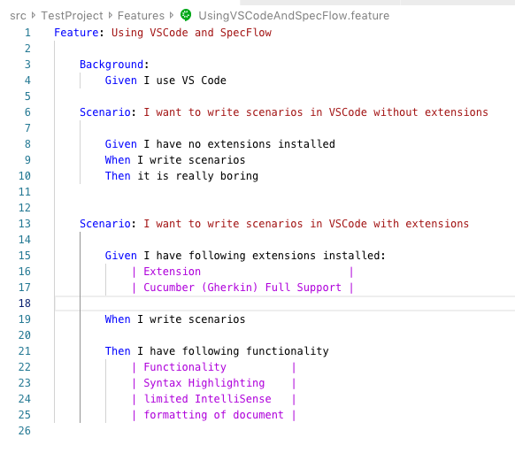
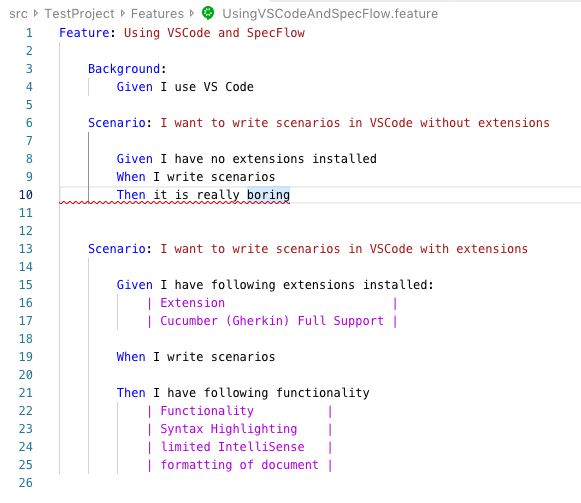

# How to use VSCode to work with SpecFlow

Using VSCode to write your SpecFlow scenarios is easy, if you install the right extension and have setup your project right.

## Project setup

You have to use MSBuild to generate the code-behind files of your feature files.  
See <insert link to MSBuild blog post here> how to do this.

Without this, you don't get any tests to execute.

## Install VSCode Extension and configure it

### For Writing Feature Files

We found a really good extension from Alex Krechik which provides a lot of nice features for writing feature files.  
It is called `Cucumber (Gherkin) Full Support Extension for VSCode` and can be found [here](https://marketplace.visualstudio.com/items?itemName=alexkrechik.cucumberautocomplete).

The extension provides for .NET projects following features:

- Syntax highlighting
- formatting of whole feature file
- limited IntelliSense/AutocComplete

We didn't got the AutoComplete from steps that are defined in the C# code to work. If you know how to do it, please give us a hint.

After installing the extension, you can configure it in the `settings.json`. This is mostly needed for the IntelliSense/AutoComplete information (which doesn't work with C#), so you could skip this.  
If you want to do it, you can find here the steps to do so: <https://github.com/alexkrechik/VSCucumberAutoComplete#how-to-use>

When you are done with it, you will get nice colorful feature files in VSCode:

### For Executing the Scenarios

If you are used to the Test Explorer of Visual Studio and don't like to execute the tests via command line, there is an extension from Jun Han to bring this feature to VSCode.  
It's the `.NET Core Test Explorer` extension, which is available [here](https://marketplace.visualstudio.com/items?itemName=formulahendry.dotnet-test-explorer)

After configuring the `dotnet-test-explorer.testProjectPath` path in your settings.json, you can start to use it.
For this example project, the test explorer looks like this:

**Before executing the scenarios:**

**After executing the scenarios:**

And so does it look like in a feature file:

You don't get the scenario at his title marked as failing, but you have the red lines at the last step of the failing scenario.

## Conclusion

Yes, we don't have a dedicated SpecFlow extension for VSCode. But there are already other extensions out there, that helps you to use VSCode for writing feature files and executing scenarios.